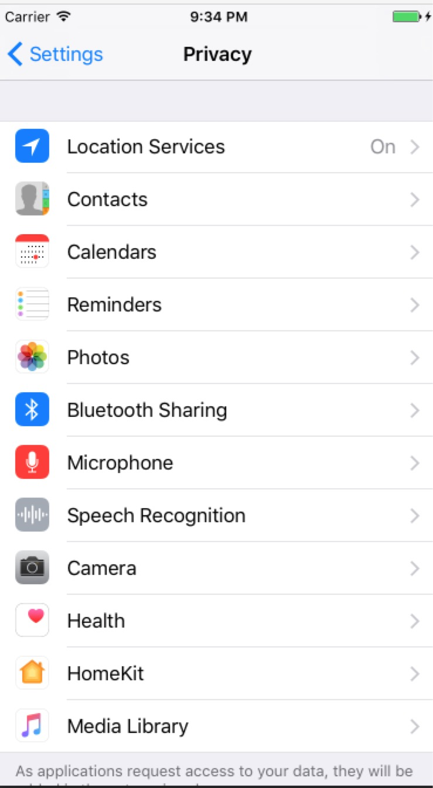

# AuthorizationManager
AuthorizationManager


### 简介
对App授权进行申请并进行相关提示,授权信息如下面所示:  


### 使用
1. 导入
	* 导入`Authorization`到项目中
	* Pod安装  

			pod 'AuthorizationManager', '~> 1.0'
	
2. 如果是iOS10中,如果想要访问需要在info.plist中添加下面信息:

	```
    <key>NSCameraUsageDescription</key>
    <string>请求访问相机</string>
    <key>NSContactsUsageDescription</key>
    <string>请求访问联系人</string>
    <key>NSLocationAlwaysUsageDescription</key>
    <string>我们需要通过您的地理位置信息获取您周边的相关数据,提供精准服务</string>
    <key>NSLocationWhenInUseUsageDescription</key>
    <string>我们需要通过您的地理位置信息获取您周边的相关数据,提供精准服务</string>
    <key>NSMicrophoneUsageDescription</key>
    <string>请求访问麦克风</string>
    <key>NSPhotoLibraryUsageDescription</key>
    <string>请求访问相册</string>

	```

3. 导入头文件

		#import "AuthorizationManager.h"

4. 申请相关权限

		[[AuthorizationManager sharedInstance] requestAuthorizationType:SIAuthorizationTypeAddressBook] ;
